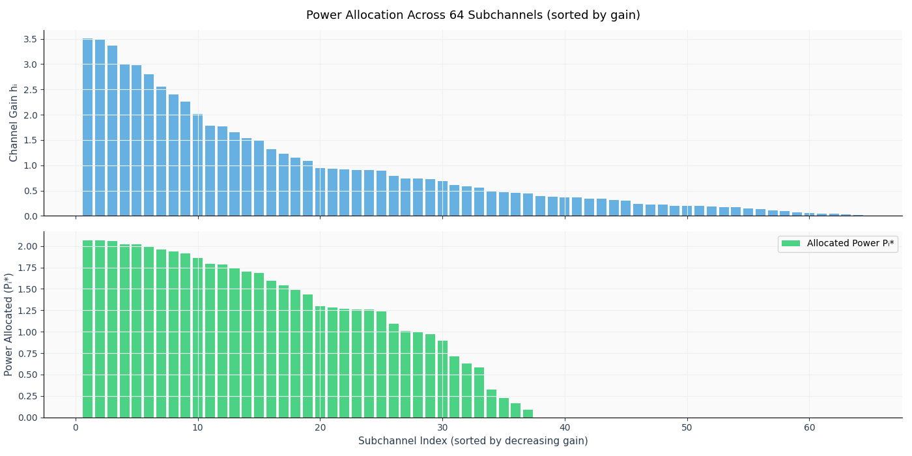
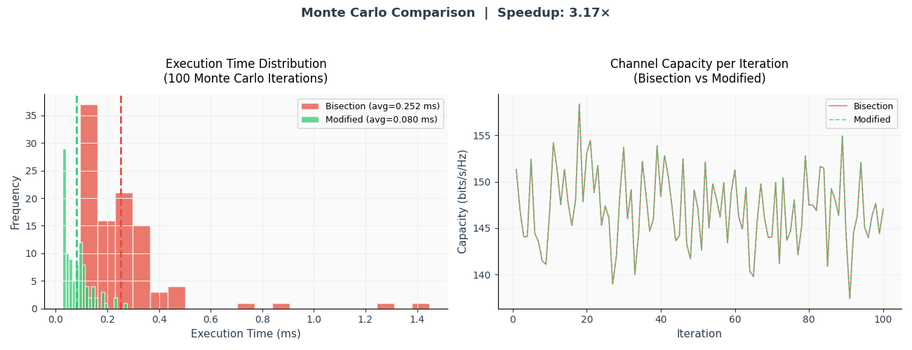
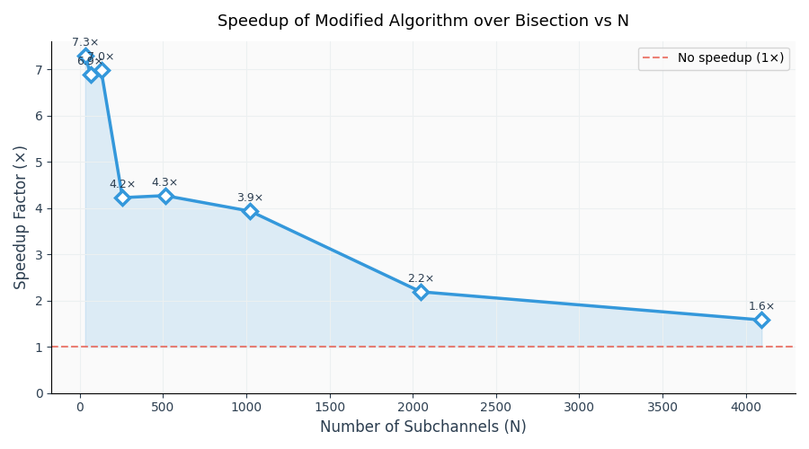

# Modified Water-Filling Algorithm for Optimal Power Allocation in OFDM Systems

> **Convex Optimisation Course Project — Team 15**
> Department of Electrical Engineering , IIT Hyderabad

---

## Overview

This repository implements and benchmarks two algorithms for the classical **water-filling power allocation problem** in OFDM systems:

- **Bisection Method** — the standard iterative approach, complexity O(N · log(1/ε))
- **Modified Exact Algorithm** *(Yu et al., 2016)* — a fully vectorised, non-iterative approach, complexity O(N log N)

The problem is to maximise total channel capacity across N parallel subchannels under a fixed sum-power budget — a convex optimisation problem solved analytically via KKT conditions. The key result: the modified algorithm is **3.36× faster** at N = 1024, with **zero loss in capacity**.

---

## The Problem

Given N OFDM subchannels with gains h₁, …, hN and total power P_total:

```
maximise    Σᵢ log₂(1 + Pᵢ hᵢ)
subject to  Σᵢ Pᵢ ≤ P_total,   Pᵢ ≥ 0
```

The KKT conditions yield the closed-form **water-filling equation**:

```
Pᵢ* = max{ 0,  1/μ − 1/hᵢ }
```

where `1/μ` is the water level (Lagrange multiplier for the sum-power constraint). Subchannels whose noise floor `1/hᵢ` exceeds the water level receive zero power.

---

## Results

### Monte Carlo (N = 1024, 100 Rayleigh-fading realisations)

| Algorithm | Avg. Time (ms) | Capacity (bits/s/Hz) | Speedup |
|---|---|---|---|
| Bisection Method | 0.1223 ± 0.0203 | 147.13 | 1.00× |
| Modified Exact (Yu et al.) | 0.0364 ± 0.0121 | 147.13 | **3.36×** |

Both algorithms produce **identical** capacity values — the modified algorithm is exact, not approximate.

### Scaling (N = 32 to 4096)

| N | Bisection (ms) | Modified (ms) | Speedup |
|---|---|---|---|
| 32 | 0.0890 | 0.0149 | 5.96× |
| 64 | 0.0867 | 0.0139 | 6.25× |
| 128 | 0.1095 | 0.0179 | 6.11× |
| 256 | 0.0997 | 0.0188 | 5.31× |
| 512 | 0.1096 | 0.0248 | 4.41× |
| 1024 | 0.1230 | 0.0343 | 3.58× |
| 2048 | 0.4225 | 0.0553 | 7.64× |
| 4096 | 0.1941 | 0.0983 | 1.97× |

### Plots

| Power Allocation | Monte Carlo Comparison |
|---|---|
|  |  |



---

## Repository Structure

```
Water-Filling-Algorithm/
│
├── water_filling_simulation.py   # Main simulation: both algorithms + all plots
├── allocation.png                # Power allocation visualisation (N=1024)
├── montecarlo.png                # Monte Carlo timing & capacity comparison
├── speedup.png                   # Speedup vs. N scaling plot
└── Convex_Optimization_Final.pdf # Full project report
```

---

## Getting Started

### Prerequisites

```bash
pip install numpy matplotlib
```

### Run

```bash
python water_filling_simulation.py
```

This runs both algorithms on a fixed-seed realisation (N = 1024, P_total = 50), then executes the Monte Carlo and scaling experiments, and saves all plots.

---

## How the Modified Algorithm Works

The key insight (Yu et al., 2016): the optimal active set can be found algebraically without iterative search.

```
1. Compute noise floors:  nᵢ = 1/hᵢ
2. Sort ascending:        n₍₁₎ ≤ n₍₂₎ ≤ … ≤ n₍ₙ₎
3. Prefix sums:           Sₖ = Σᵢ₌₁ᵏ n₍ᵢ₎
4. Candidate water levels: Wₖ = (P_total + Sₖ) / k,  for k = 1…N
5. Find active set size:  k* = max{ k : Wₖ > n₍ₖ₎ }
6. Allocate:              Pᵢ* = max{ 0,  W_{k*} − nᵢ }
```

Steps 3–4 use `np.cumsum`, making the entire procedure fully vectorised — no Python-level loops.

---

## References

- T. M. Cover and J. A. Thomas, *Elements of Information Theory*, 2nd ed., Wiley, 2006.
- D. P. Palomar and M. Chiang, "A tutorial on decomposition methods for network utility maximization," *IEEE J. Sel. Areas Commun.*, vol. 24, no. 8, 2006.
- P. He, L. Zhao, S. Zhou, and Z. Niu, "Water-filling: A geometric approach," *IEEE Trans. Wireless Commun.*, vol. 12, no. 7, 2013.
- W. Yu, Z. Lai, and W. Wang, "A modified water-filling algorithm of power allocation for OFDM system," *IEEE ITNEC*, 2016.

---

## Team

| Name | Roll No. |
|---|---|
| Hiba Muhammed | EE23BTECH11026 |
| Nimal Sreekumar | EE23BTECH11044 |
| P.V. Chanakya | EE23BTECH11048 |
| Praful Kesavadas | EE23BTECH11049 |
| Koleti Yashwanth | CO23BTECH11009 |
